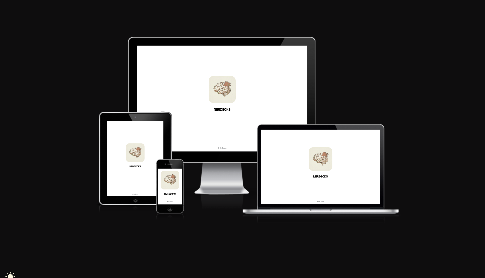
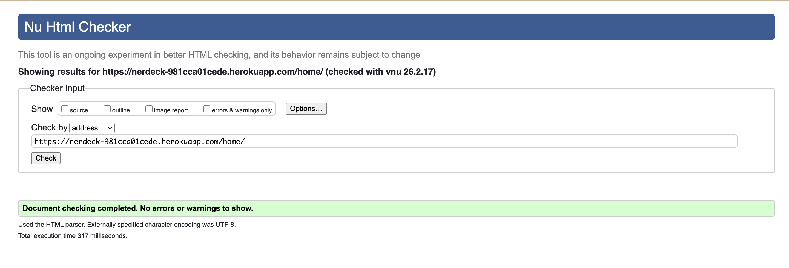

# NerDecks

A spaced repetition web application that helps users remember information efficiently by reviewing cards at scientifically optimized intervals.

https://nerdeck-981cca01cede.herokuapp.com/

---

# Table Of Contents

- Design & Planning  
- Features  
- Technologies Used  
- Testing  
- Bugs  
- Deployment  
- AI  
- Credits  

---

# Design & Planning
Before writing a single line of code, this project was shaped through intentional design decisions and structured planning. The goal was simple: build a focused learning tool that feels clean, intuitive, and distraction-free — but under the surface, is powered by solid logic.

This section outlines how the idea was translated into concrete user stories, visual wireframes, an Agile workflow, and a clear data structure. Every feature began as a user need. Every screen started as a sketch. Every model existed for a reason.

## User Stories

### Core Learning Flow

	•	As a user, I want a clear understanding of what the app does and how it helps me learn so I can decide whether to use it.
	•	As a user, I want to create an account so I can save my decks and cards.
	•	As a user, I want to log in securely so I can access my personal learning material.
	•	As a user, I want to create decks so I can organize my study topics.
	•	As a user, I want to create cards inside decks so I can break down topics into manageable pieces of information.
	•	As a user, I want to review cards using spaced repetition so I can retain information long term.
	•	As a user, I want to mark cards as correct or incorrect so the system can adjust future review timing automatically.
	•	As a user, I want to see only my own decks and cards so my learning content remains private.
	•	As a user, I want a clean and minimal interface so I can focus on studying without distractions.

---

## Wireframes

For the wireframe design, I used Adobe XD to map out the structure and flow of the application before development began. This allowed me to visualize the user journey, test layout decisions, and ensure the interface remained clean and intuitive. By defining the core screens and interactions early on, I was able to align the visual structure with the project’s functional goals and maintain consistency throughout the build process.

---

## Agile Methodology

The project was developed using an iterative Agile approach:

- Features were broken down into user stories.
- Stories were grouped into iterations (MVP first).
- Tasks were created for:
  - Models
  - Views
  - Templates
  - Spaced repetition logic
  - Authentication
  - UI improvements

Kanban board structure:  
- To Do  
- In Progress  
- Testing  
- Done  

---

## Typography

The project uses:

- Inter – for clean, readable UI text
- Space Grotesk – for headings and branding
- Fredoka – for playful brand personality

These fonts were chosen for clarity and modern appearance.

---

## Colour Scheme

Primary:
- White (#FFFFFF)
- Light Gray (Bootstrap light backgrounds)

Accent:
- Blue (Bootstrap primary)
- Custom brand colors for NerDeck logo

Coolors.co was used as reference for quick colors pallete selection.

---

## Database Diagram

Main Models & Relationships

The application is built around a structured learning hierarchy with clear separation between content and learning logic.

### Main models

- Folder
- Deck
- Card
- CardSRS
- ReviewSession
- User (Django built-in model)

---

### Relationships

- One User → Many Folders
- One User → Many Decks
- One Folder → Many Decks
- One Deck → Many Cards
- One Card → Exactly One CardSRS (One-to-One)
- One User → Many ReviewSessions

⸻

Model Overview

Users organize their study material into Folders, which contain Decks representing topics.

Each Deck contains multiple Cards, where the actual learning content is stored (front and back text).

Every Card has a dedicated CardSRS model that stores its spaced repetition data — such as due date, interval, ease factor, repetitions, and lapses. This keeps the learning algorithm separate from the content itself.

Finally, ReviewSession tracks study activity, linking sessions to users and recording when they start and end, as well as the study mode.

⸻

In summary, the structure follows a clear hierarchy:

User → Folder → Deck → Card → SRS State
Plus: User → Review Sessions

This modular design keeps organization, learning logic, and tracking cleanly separated and scalable.

---

# Features

## Navigation

- Responsive top navigation
- Links change depending on authentication status
- Clean minimal layout

---

## Footer

- Simple copyright section
- Consistent across all pages

---

## Home Page

- Explanation of spaced repetition
- Call to action (Create account)
- Minimal visual storytelling

---

## CRUD Functionality

### Deck
- Create deck
- View deck
- Delete deck

### Card
- Create card
- Review card
- Update/Edit Card
- Delete card

Cards are filtered by logged-in user.

---

## Authentication & Authorisation

- Django authentication system
- Login / Logout
- Signup
- User-based data isolation

---

# Technologies Used

- Python
- Django
- HTML5
- CSS3
- Bootstrap 5
- JavaScript 
- SQLite (development)
- PostgreSQL (production)
- Heroku
- Git & GitHub
- Adobe XD
- Adobe Premier Pro
- Adobe Photoshop
- Adobe Illustrator
- Adobe Firefly
- ElevenLabs
- NanoBanana 

---

## Libraries

- Bootstrap
- GSAP
- Django built-in auth
- WhiteNoise
- Gunicorn

---

# Testing

## Google Lighthouse Performance

---

## Browser Compatibility

Tested on:
- Chrome
- Safari
- Firefox

---

## Responsiveness

Tested on:
- Mobile
- Tablet
- Desktop

---

## Code Validation

Validated:

- HTML → W3C Validator

- CSS → W3C Validator

- JS → JSHint

- Python → PEP8

---

## Manual Testing – User Stories

| User Story | Test | Pass |
|------------|------|------|
| Create account | User fills signup form and is redirected | ✓ |
| Login | User logs in with valid credentials | ✓ |
| Create deck | User submits deck form | ✓ |
| Create card | User submits card form | ✓ |
| Review card | User marks correct/incorrect | ✓ |

---

## Manual Testing – Features

| Feature | Action | Status |
|----------|--------|--------|
| Deck creation | Submit valid form | ✓ |
| Card filtering by user | Login as different user | ✓ |
| Admin filtering | Filter cards by username | ✓ |
| Spaced repetition logic | Correct answer increases interval | ✓ |

---

# Bugs

- Cards not filtered by user in admin → Fixed via admin configuration.
- Redundant user column in admin table → Cleaned configuration.
- Git push conflicts → Resolved with pull and merge.
- Static files not loading in production → Fixed via WhiteNoise.

---

# Deployment

This website is deployed to Heroku from a GitHub repository.

## Creating Repository on GitHub

1. Create repository.
2. Clone locally.
3. Develop project.
4. Push to GitHub.

## Creating an App on Heroku

1. Log in to Heroku.
2. Create new app.
3. Connect GitHub repository.

## Database

- Created PostgreSQL database.
- Set DATABASE_URL in env.py and Heroku config vars.

## Config Vars

- DATABASE_URL
- SECRET_KEY
- CLOUDINARY_URL
- PORT = 8000

## Deployment

- Manual deploy from Heroku dashboard.
- Deploy branch.
- View app.

---

# AI

AI was used for:

- Explaining Django concepts
- Debugging admin and model structure
- Improving UI structure
- Implementing spaced repetition logic

---

# Credits

- Django documentation
- Bootstrap documentation
- GSAP documentation
- Google Fonts
- Code Institute deployment guide
- OpenAI
